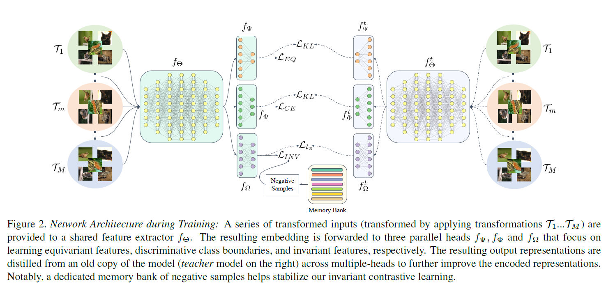
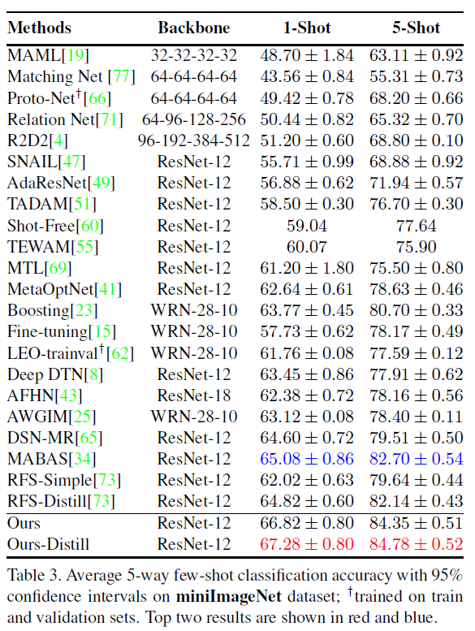
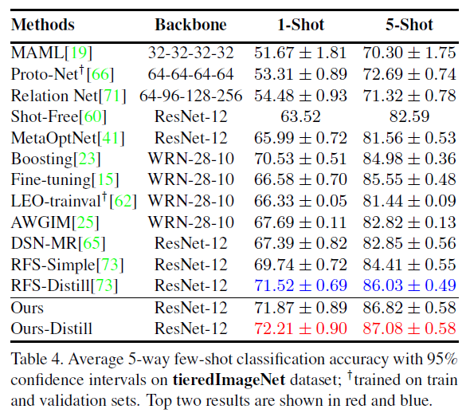

今天看的这篇比较简单，是一篇来自 CVPR 2021 的小样本图像分类论文。论文的标题是 Exploring Complementary Strengths of Invariant and Equivariant Representations for Few-Shot Learning[^1]，官方代码[^2]，Fork了一份防删[^3]（看 Issue 的讨论[^4]，这个方法似乎很消耗显存，有时间试试好了）。

## 基本思想

这篇论文的工作在分类上属于最近比较常见的类别，即学习一个 better embedding。提出的方法也非常简单，一句话来概括就是用「多任务学习」的方式，把自监督学习中的 「学习不变性 Invariant」 和 「学习变性 Equivariant」 两个 「流派」 的损失函数整合起来，再加上标准的分类损失函数，一同学习一个厉害的特征提取器，来提升小样本任务的分类精度。另外作者还用到了一个叫做「多头自蒸馏」的方法进一步涨点，还挺神奇的。不过之前没接触过知识蒸馏，也不知道这个方法是作者发明的还是前人工作。

一句题外话，把不变性和变性损失用多任务学习整合这个想法我在前段时间看自监督学习论文的时候也想到了，不过一直还没有尝试... 唉，日常被自己菜哭😢。

## 方法

让我们跳过无聊的「编故事」环节，来看看本文提出的方法吧~

下图就是本文方法的网络架构图。其中这种对称的结构就是所谓的**教师-学生结构**，右边的是教师网络（也就是旧模型），左边是学生网络（新模型），学生网络学习教师网络（这部分具体如何操作的我也不太理解，之后看完代码再回来补充吧~）。

因为教师和学生网络结构是一样的，所以只关注左边就好了。从图上可以看到，最左侧有 $M$ 簇图片，分别代表了不同的几何变换（Geometric Transformation），也就是说，一组样本会用 $M$ 种变换方式生成 $M$ 组图像，然后这些图像之后会输入同一个特征提取器里提取特征。那这些变换具体是什么呢？原文中举了一些例子，包括：Euclidean transformation、Similarity transformation、Affine transformation 以及 Projective transformation。变换组合的选取与具体的任务和数据集有关，至于本文的具体选取可以参考论文的第四章。

总之，这些样本会同时输入特征提取器网络 $f_{\Theta}$ 来提取特征，这些特征随后被输入三个不同的 MLP 头：$f_{\Psi}$、$f_{\Phi}$和$f_{\Omega}$，之后会解释每个头的作用。特征提取完毕后，网络会用四种不同的方式来处理这些 embedding ，分别是：有监督分类、变性(Equivariant)自监督、不变(Invariant)自监督和多头自蒸馏。

1. **有监督分类**

   相关的 MLP 头是$f_{\Phi}$。这个头把特征映射和 Softmax 为预测概率，然后计算交叉熵分类损失，文中称之为 $\mathcal{L}_{\text {baseline }}$。

2. **变性(Equivariant)自监督**

   相关的 MLP 头是$f_{\Psi}$。所谓变性(Equivariant)自监督，就是意在让模型捕捉图像的变化。具体来说，因为有 $M$ 种变换嘛，于是就用 one-hot 的方式给每个样本指定一个标签 $\mathbf{u}$，其中 $\mathbf{u} \in\{0,1\}^{M}$, $ \sum_{i} \mathbf{u}_{i}=1$。图像特征输入 $f_{\Psi}$，这个头把特征映射为 $M$ 维预测概率，随后利用自动生成的自监督标签计算交叉熵分类损失，文中称这个损失为$\mathcal{L}_{\text {eq }}$。

3. **不变(Invariant)自监督**

   相关的 MLP 头是$f_{\Omega}$。所谓不变(Invariant)自监督，就是让模型捕捉图像的变化中的不变性。作者在这里巧妙的使用了自监督学习中的对比学习(Contrastive learning)方法来实现。$f_{\Omega}$头类似于对比学习中常用的投影头，主要是对特征进行降维。

   如架构图所示，类似于MoCo[^5]，作者用了一个 Memory Bank 来将负样本数量与批大小解耦，这部分的损失函数如下：

   
$$
   \mathcal{L}_{i n}=-\frac{1}{M} \sum_{m=0}^{M-1} \log \left(h\left(\mathbf{v}^{r}, \mathbf{v}^{m}\right)\right)\left\{\begin{array}{l}
   m \neq 0 \rightarrow \mathbf{v}^{r}=\mathbf{v}^{0} \\
   m=0 \rightarrow \mathbf{v}^{r}=\tilde{\mathbf{v}}^{0}
   \end{array}\right.
   $$

   

   其中，$\mathbf{v}^{0}$ 表示没有变换的原始图像的特征，$\tilde{\mathbf{v}}^{0}$ 表示 Memory Bank 中 $\mathbf{v}^{0}$ 的旧的值。$h(\cdot)$ 定义为：

   
   $$
   h\left(\mathbf{v}^{r}, \mathbf{v}^{m}\right)=\frac{\exp \left(\frac{s\left(\mathbf{v}^{r}, \mathbf{v}^{m}\right)}{\tau}\right)}{\exp \left(\frac{s\left(\mathbf{v}^{r}, \mathbf{v}^{m}\right)}{\tau}\right)+\sum_{\mathbf{v}^{\prime} \in \mathcal{D}_{n}} \exp \left(\frac{s\left(\mathbf{v}^{\prime}, \mathbf{v}^{m}\right)}{\tau}\right)}
   $$
   

   这个就是常规的 Contrastive Loss，注意作者还最大化了$\mathbf{v}^{0}$ 和 $\tilde{\mathbf{v}}^{0}$ 的相似度，解释说这样能够使得训练稳定。

4. **多头自蒸馏**

   这部分没有新的MLP头，损失定义如下：

   
   
$$
   \begin{aligned}
   \mathcal{L}_{k d}=& \mathrm{KL}\left(f_{\Theta, \Phi}^{t}(\mathrm{x}), f_{\Theta, \Phi}(\mathrm{x})\right)+\mathrm{KL}\left(f_{\Theta, \Psi}^{t}(\mathrm{x}), f_{\Theta, \Psi}(\mathrm{x})\right) \\
   &+\mathcal{L}_{2}\left(f_{\Theta, \Omega}^{t}(\mathrm{x}), f_{\Theta, \Omega}(\mathrm{x})\right)
   \end{aligned}
   $$

   

   其中 $f_{(\cdot)}^{t}$ 和$f_{(\cdot)}$ 分别表示教师网络和学生网络，损失定义为他们输出的 KL 散度和，目的就是让学生网络学习教师的输出。注意这里由于不变(Invariant)自监督中的$f_{\Omega}$头输出的不是 softmax 概率，所以作者改成了 L2 损失（原因暂时不清楚，可能是工程经验或者是 KL散度的性质决定的）。

整体的损失就是各部分损失加和。

## 实验结果

直接摆出 mini-IN 和 tiered-IN 的结果，在 inductive FSL 里面应该是 SOTA 吧。另外消融实验里面有一些有意思的实验，比如探讨不同的自监督方法的效果，有时间可以细看一下。

**mini-IN**：

**tiered-IN**：

[^1]: M. N. Rizve, S. Khan, F. S. Khan, and M. Shah, “Exploring Complementary Strengths of Invariant and Equivariant Representations for Few-Shot Learning,” *arXiv:2103.01315 [cs]*, Apr. 2021, Accessed: Jun. 02, 2021. [Online]. [Available](http://arxiv.org/abs/2103.01315)
[^2]: [nayeemrizve/invariance-equivariance](https://github.com/nayeemrizve/invariance-equivariance)
[^3]: [TildenJ/invariance-equivariance](https://github.com/TildenJ/invariance-equivariance)
[^4]: [Pretrained models ## 2](https://github.com/nayeemrizve/invariance-equivariance/issues/2)
[^5]: K. He, H. Fan, Y. Wu, S. Xie, and R. Girshick, “Momentum Contrast for Unsupervised Visual Representation Learning,” *arXiv:1911.05722 [cs]*, Mar. 2020, Accessed: Jan. 06, 2021. [Online]. [Available](http://arxiv.org/abs/1911.05722)
