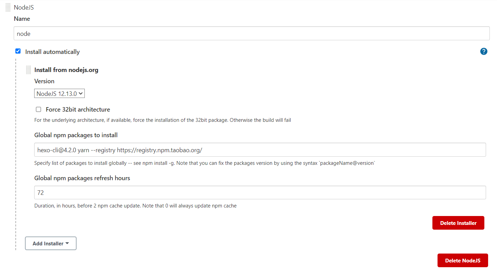
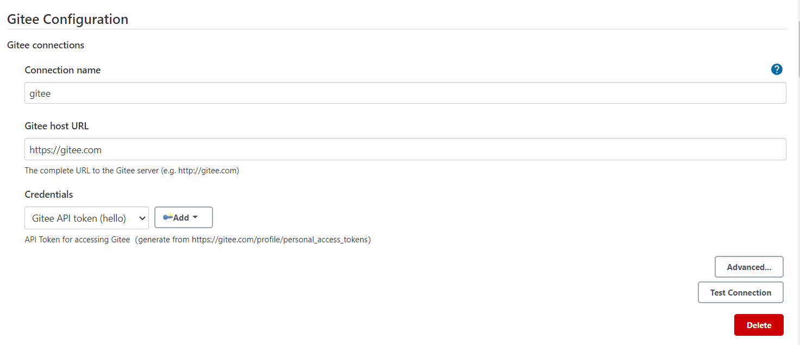
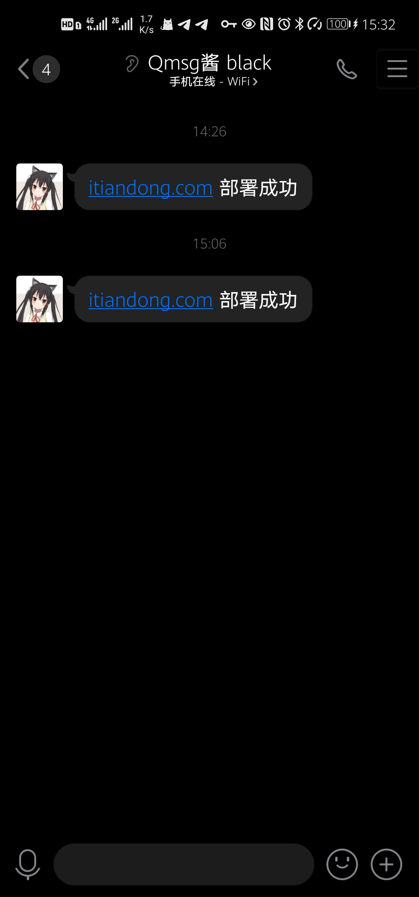

> 本文介绍如何在`自建服务器`上使用 `Jenkins` 和 `Gitee` 部署博客，当 Git 仓库发生变更后能自动部署并发布博客。本文以 Hexo 为例，其他静态网站生成器的操作类似。

## 环境信息

| 环境     | 版本      |
| -------- | --------- |
| 操作系统 | CentOS 7  |
| Jenkins  | 2.277.4   |
| JDK      | 1.8.0_282 |
| Nginx    | 1.18.0    |
| Git Host | Gitee     |

## 配置 Jenkins

### 安装 Jenkins

参考 [官方文档](https://www.jenkins.io/doc/book/installing/linux/) 安装即可， `CentOS` 的步骤如下 ：

```bash
# 添加 Yum 源
sudo wget -O /etc/yum.repos.d/jenkins.repo https://pkg.jenkins.io/redhat-stable/jenkins.repo
# 导入密钥
sudo rpm --import https://pkg.jenkins.io/redhat-stable/jenkins.io.key

sudo yum install -y jenkins
```

（**可选**）Jenkins 默认端口为 8080，可以在配置文件里修改：

```bash
vim /etc/sysconfig/jenkins
# 修改 JENKINS_PORT=xxx 即可
```

最后添加开机启动：

```bash
# 重载服务（由于前面修改了 Jenkins 启动脚本）
sudo systemctl daemon-reload

# 启动 Jenkins 服务
sudo systemctl start jenkins

# 将 Jenkins 服务设置为开机启动
# 由于 Jenkins 不是 Native Service，所以需要用 chkconfig 命令而不是 systemctl 命令
sudo /sbin/chkconfig jenkins on
```

### Jenkins 初始化

确保所设置的端口在防火墙里已开放，浏览器访问 `<ip>:<port>`，按照向导完成初始化。

### 安装插件

#### 安装配置 NodeJS Plugin

登录 Dashboard，选择 Manage Jenkins > Manage Plugins，点击 Available，安装 `NodeJS Plugin`。

然后在 Dashboard > Manage Jenkins > Global Tool Configuration 里下滑找到 NodeJS ，点击 NodeJS installations ...，配置如下：



选择 Node 版本，在 Global npm packages to install 里填入 `Hexo` 和 `Yarn` 依赖：

```
hexo-cli@4.2.0 yarn --registry https://registry.npm.taobao.org/ 
```

点 Save 保存。

#### 安装 Gitee Plugin

由于 Github 在国内网络几乎不可用，这里把 Host 换成了 `Gitee`，因此还需要安装一个 [Gitee Plugin](https://plugins.jenkins.io/gitee)。

Gitee 的配置参考 Gitee 的官方[帮助中心](https://gitee.com/help/articles/4193)：

简单来说，在 Jenkins -> Manage Jenkins -> Configure System -> Gitee Configuration -> Gitee connections 里，按照文档配置如下：



## 添加 CI 任务

### 配置密钥（可选）

若博客代码托管在私人仓库，需要额外生成密钥对并把公钥添加到 Gitee 里。如果你的仓库是公开状态，这一步可以跳过。

切换到 Jenkins 用户：

```bash
sudo su -s /bin/bash jenkins
```

生成密钥对：

```bash
ssh-keygen -o
```

查看公钥并复制：

```bash
cat ~/.ssh/id_rsa.pub
```

然后在 Gitee 网站右上角 个人头像 > 设置 > SSH公钥 里粘贴公钥，点确定保存。

### 新建 CI 任务

#### 新建任务

接下来就可以在 Jenkins 里新建构建博客的 CI 任务了！

打开 Dashboard，点击 New Item。输入 Item name，类型选择 Freestyle project。配置页里 Gitee connection 选择之前配置的 connection。

在 Source Code Management 里选择 Git，Repository URL 里填入仓库链接，如果这个时候显示权限失败，参照上一小节配置密钥。

在 Build Triggers 里选择 `Build when a change is pushed to Gitee. Gitee webhook URL: http://xxxx:xxx/gitee-project/blog` ，注意复制这里的 webhook url，之后会用到。

然后再 Enabled Gitee triggers 里选中 `Push Events`，`Secret Token for Gitee WebHook` 里点击 Generate，同样保存备用。

#### Gitee 配置 Webhook

之前配置的 Webhook 需要在 Gitee 上同样配置一下才能正常工作：

登陆 Gitee 后在仓库主页点击 管理 > WebHooks > 添加 WebHooks，然后填入刚刚保存的 `url` 和 `token`，保存即可。

#### 编写构建脚本

回到任务配置页，继续添加自动构建脚本：

在 Build 里点击 Add build step，选择 Execute shell，根据网站和博客的具体情况编写构建部署命令。以 Hexo 为例，命令如下：

```bash
# --prod 表示不安装 devDependences
yarn install --prod --registry https://registry.npm.taobao.org/

# Hexo 生成脚本
hexo clean
hexo generate

# 部署脚本
rm -rf /www/wwwroot/mysite/*
cp -a ./public/. /www/wwwroot/mysite/
```

> 2021年5月28日 更新，部署 `mkdocs` 的脚本如下：
>
> ```bash
> /usr/bin/pip3.6 install -i https://pypi.tuna.tsinghua.edu.cn/simple mkdocs-material --user
> /usr/bin/python3 -m mkdocs build
> 
> rm -rf /www/wwwroot/mymkdocssite/*
> cp -a ./site/. /www/wwwroot/mymkdocssite/
> ```
>

#### 测试部署

完成 CI 任务的创建后，回到 Project 页面，点击 Build now，观察是否一切正常。然后通过 Git 更改后 push，测试 WebHook 是否正常。

如果部署时提示权限不足，可以把网址所在的目录 owner 改为 jenkins 来解决。

```bash
sudo chown -R jenkins:jenkins mysite/
```

## 其他

### 推送

原来用 `Vercel` 的时候，每次构建完毕，`Vercel Bot` 就会给我的仓库的 Commit 评论一下，然后会收到 Github 发来的邮件，提醒构建已完成，非常好用。当然，现在这个功能也只能自己写了。因为是国内服务器，所以排除了用 Telegram 推送。搜索了一下，发现了一个通过 QQ 推送消息的网站 [Qmsg酱](https://qmsg.zendee.cn/)，按照[文档](https://qmsg.zendee.cn/api.html)注册配置后可以获得一个 Qmsg Key，然后就可以调用 RESTful 接口发起推送了！

配置非常简单，在构建脚本的最后添加如下命令即可：

```bash
curl --location --request POST 'https://qmsg.zendee.cn/send/<你的 qmsgKey>' \
--header 'Content-Type: application/x-www-form-urlencoded' \
--data-urlencode 'msg=itiandong.com 部署成功'
```

这样每次部署完成，你会收到一条 QQ 消息：



### 使用 Githu & Gitee 双仓库

这次迁移的过程中也遇到了一些坑。最开始本来打算沿用 Github 的，但测试发现 Clone 总是出错，于是被迫改成国内的 Gitee。可以在原仓库上额外添加 Gitee 远程仓库地址，让 Github 和 Gitee 并存：

```bash
git remote add gitee <url>
```

然后提交时，分别执行：

```bash
git push origin master
git push gitee master
```

就可以分别提交到两个仓库里了。
